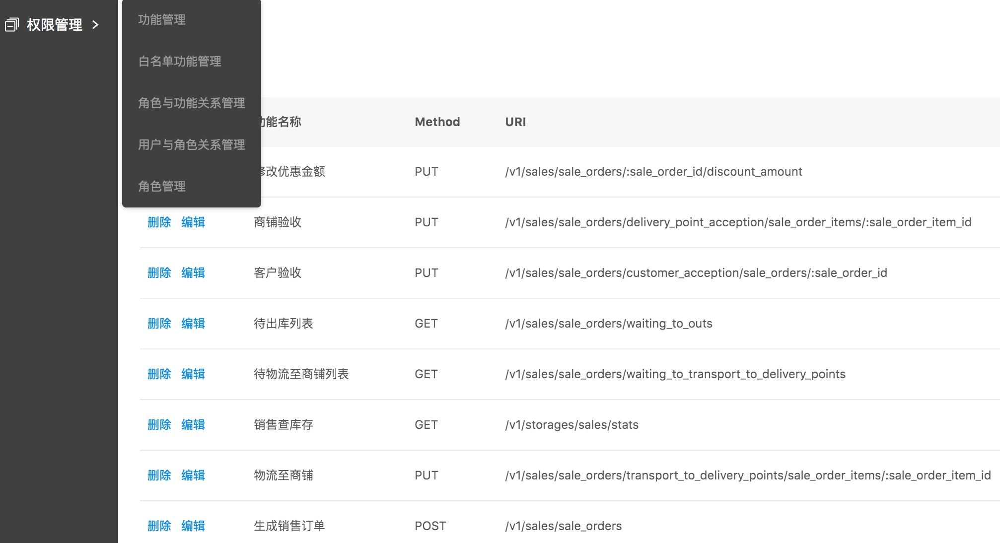

# 权限管理服务平台

该服务采用比较流行的微服务思想, 利用[**shiro**](http://shiro.apache.org/)<域，动作，实体>思想，实现权限管理平台服务， 它支持**单用户多角色** , 比RBAC的资源管理更细粒度化  

权限管理服务平台的实现，主要由三个步骤构成： 
+ 第一步：判断URL是否在白名单中，如果是，直接返回状态码：200  
+ 第二步：解析URL，获取功能ID和实体ID，服务初始化阶段，会构建多叉树  
+ 第三步：获取<域，动作，实体>, 并在redis中采用SET集合存储<UserId-FuncId, SET集合={实体1, 实体2, ... , 实体N}>

## 权限管理库表设计

[权限管理库表](table.md)

## 环境依赖

+ [beego框架](https://beego.me/)
+ [redis](https://redis.io/)

## OpenResty配置

权限管理安插在Nginx Access访问阶段，对http请求的合法性进行校验

access_by_lua_file "/data/openresty/lua_files/test_ycfm_lua_files/access_by_grbac.lua"

```lua
-- GRBAC权限管理模块
ngx.req.read_body()
local bodyData = ngx.req.get_body_data()
ngx.log(ngx.ERR, "body data:", bodyData)
local cjson = require "cjson"
local info={
        ["body"] =  bodyData,
        ["method"] = ngx.req.get_method(),
        ["uri"] = ngx.var.uri,
}
local encode = cjson.encode(info)
local res = ngx.location.capture('/v1/grbac/functions/tree_parsing', {method=ngx.HTTP_POST, body=encode})
if res.status == 403 then
        ngx.exit(ngx.HTTP_FORBIDDEN)
end
--- 这里需要注意的地方：
--- 当http请求头Content-type: multipart/form-data时，由于子请求继承父请求的信息，导致body无法改变
--- 需要在nginx中location ~ /v1/grbac体中增加下面一句：
——- `proxy_set_header   Content-Type   "application/x-www-form-urlencoded"`;
--- 这样做body=encode才能生效
```
## DEMO


## 解析树性能测试结果
测试数据：
```
functions表： 共259条
role_function_relationships表：1036条
roles表： 7条
user_roles表: 31条
white_list表: 85条
```

可以看到一个请求耗时平均: `0.108ms`

ab结果中指标说明，可参考[ab test](https://gist.github.com/JingwenTian/8591073)
```
ab -c 8000 -n 800000 -p post.txt -H "Accept: application/json"  -H "XXXX-XXXX-XXX-Id: 12" -H "XXXX-XXXX-XXXX-Id: 3"  http://120.**.**.193:30100/v1/grbacs/functions/tree_parsing
This is ApacheBench, Version 2.3 <$Revision: 1604373 $>
Copyright 1996 Adam Twiss, Zeus Technology Ltd, http://www.zeustech.net/
Licensed to The Apache Software Foundation, http://www.apache.org/

Benchmarking 120.**.**.193 (be patient)
Completed 80000 requests
Completed 160000 requests
Completed 240000 requests
Completed 320000 requests
Completed 400000 requests
Completed 480000 requests
Completed 560000 requests
Completed 640000 requests
Completed 720000 requests
Completed 800000 requests
Finished 800000 requests


Server Software:
Server Hostname:        120.**.**.193
Server Port:            30040

Document Path:          /v1/grbacs/functions/tree_parsing
Document Length:        0 bytes

Concurrency Level:      8000
Time taken for tests:   86.028 seconds
Complete requests:      800000
Failed requests:        0
Total transferred:      92800000 bytes
Total body sent:        265600000
HTML transferred:       0 bytes
Requests per second:    9299.33 [#/sec] (mean)
Time per request:       860.277 [ms] (mean)
Time per request:       0.108 [ms] (mean, across all concurrent requests)
Transfer rate:          1053.44 [Kbytes/sec] received
                        3015.02 kb/s sent
                        4068.46 kb/s total

Connection Times (ms)
              min  mean[+/-sd] median   max
Connect:        0   47 219.0      3    7025
Processing:    22  810  96.5    798    2066
Waiting:       19  806  96.6    794    2050
Total:         24  857 242.3    807    7837
```

## 说明
+ `希望与大家一起成长，有任何该服务运行或者代码问题，可以及时找我沟通，喜欢开源，热爱开源, 欢迎多交流`   
+ `联系方式：cdh_cjx@163.com`
